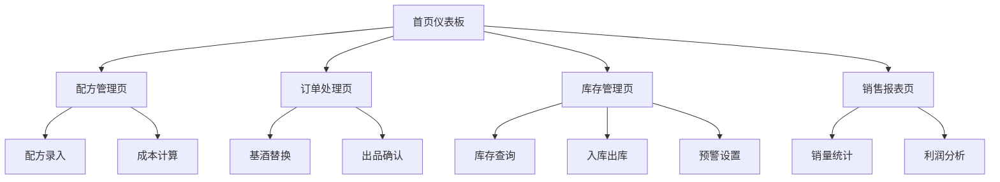

# 调酒师酒吧管理系统产品需求文档

## 1. Product Overview

本系统是一款专为小酒馆设计的轻量级管理工具，专注解决配方管理、订单处理、库存跟踪和销售统计等核心需求。

系统主要解决调酒师在日常经营中面临的配方标准化、成本计算、库存管理和基础数据统计等实际问题，帮助小酒馆实现数字化经营管理。

目标市场价值：为小酒馆提供简单易用的数字化工具，提升经营效率，降低管理成本，实现精细化运营。

## 2. Core Features

### 2.1 User Roles

| Role | Registration Method | Core Permissions |
|------|---------------------|------------------|
| 老板/店长 | 默认管理员账号 | 全部功能权限，包括配方管理、库存管理、报表查看 |
| 调酒师 | 老板创建账号 | 配方查看、订单处理、基酒替换、库存查询 |

### 2.2 Feature Module

我们的酒吧管理系统包含以下主要页面：

1. **首页仪表板**：今日销售概览、库存预警、快速操作入口、系统通知
2. **配方管理页**：鸡尾酒配方录入、成本计算、配方搜索、分步式配方创建
3. **订单处理页**：点单界面、订单管理、实时价格计算、出品确认
4. **库存管理页**：库存查询、入库出库、库存调整、预警设置
5. **销售报表页**：销量统计、热销产品、利润分析、数据导出

### 2.3 Page Details

| Page Name | Module Name | Feature description |
|-----------|-------------|---------------------|
| 首页仪表板 | 销售概览 | 显示今日销售额、订单数量、热销产品等关键指标 |
| 首页仪表板 | 库存预警 | 显示库存不足的原料，支持快速查看和补货提醒 |
| 首页仪表板 | 快速操作 | 提供快速下单、库存查询、配方搜索等常用功能入口 |
| 配方管理页 | 配方录入 | 创建新配方，输入原料清单、用量、单位、品牌信息 |
| 配方管理页 | 成本计算 | 根据原料单价和用量自动计算单杯成本，设定售价 |
| 配方管理页 | 配方搜索 | 按名称、原料、成本等条件搜索和筛选配方 |
| 订单处理页 | 点单界面 | 选择鸡尾酒、数量，显示默认配方和价格信息 |
| 订单处理页 | 基酒替换 | 支持更换基酒品牌，保持用量不变，实时重算价格和成本 |
| 订单处理页 | 出品确认 | 确认订单完成，自动扣减库存，记录销售数据 |
| 库存管理页 | 库存查询 | 查看所有原料库存状态，支持按分类筛选 |
| 库存管理页 | 入库出库 | 记录原料入库、出库操作，支持手动录入 |
| 库存管理页 | 库存调整 | 处理损耗、赠饮等库存调整，记录调整原因 |
| 库存管理页 | 预警设置 | 设置库存预警阈值，低于阈值时自动提醒 |
| 销售报表页 | 销量统计 | 按产品、时间统计销售数据，显示热销排行 |
| 销售报表页 | 利润分析 | 计算单品毛利率、总毛利额，简单的盈利统计 |
| 销售报表页 | 数据导出 | 支持报表数据导出为Excel格式 |

## 3. Core Process

### 主要用户操作流程

**店长/老板流程：**
1. 登录系统查看今日销售概览
2. 管理鸡尾酒配方和定价
3. 设置库存预警阈值
4. 查看销售报表和利润统计
5. 处理库存入库和调整

**调酒师流程：**
1. 登录系统处理顾客订单
2. 查看配方信息和制作要求
3. 根据需要替换基酒品牌
4. 确认出品完成，系统自动扣减库存

## 4. User Interface Design

### 4.1 Design Style

- **主色调**：深蓝色(#1a365d)作为主色，金黄色(#d69e2e)作为强调色
- **辅助色**：浅灰色(#f7fafc)作为背景色，深灰色(#2d3748)作为文字色
- **按钮样式**：圆角矩形按钮，简洁明了的交互反馈
- **字体**：中文使用苹方/微软雅黑，英文使用Roboto，主要字号14px-16px
- **布局风格**：简洁的卡片式布局，顶部导航栏，响应式设计
- **图标风格**：使用简洁的线性图标，酒杯等行业特色图标

### 4.2 Page Design Overview

| Page Name | Module Name | UI Elements |
|-----------|-------------|-------------|
| 首页仪表板 | 销售概览 | 简洁的数据卡片布局，关键指标突出显示，颜色编码表示状态 |
| 配方管理页 | 配方录入 | 表单式布局，原料列表使用表格，实时计算成本显示 |
| 订单处理页 | 点单界面 | 网格式产品展示，大按钮设计便于操作，价格信息突出显示 |
| 库存管理页 | 库存查询 | 列表式布局，支持筛选和搜索，库存状态用颜色标识 |
| 销售报表页 | 数据统计 | 简单的图表布局，基础的数据表格展示 |

### 4.3 Responsiveness

系统采用桌面端优先的响应式设计，主要支持桌面端和平板端访问。

- **桌面端**：完整功能界面，适合日常管理和操作
- **平板端**：优化触控操作，适合点单和库存管理
- **手机端**：基础的查询功能，简化界面设计

重点优化桌面端和平板端的使用体验，确保操作流畅简洁。