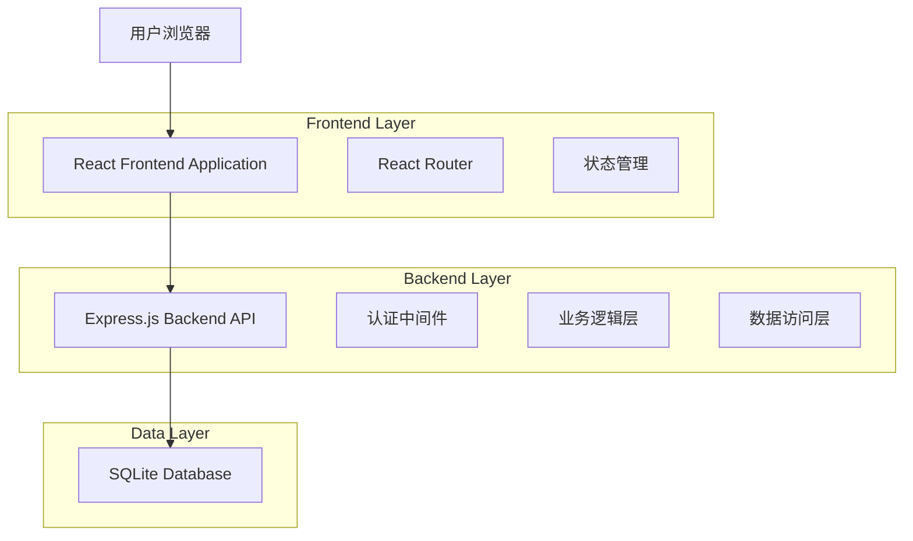
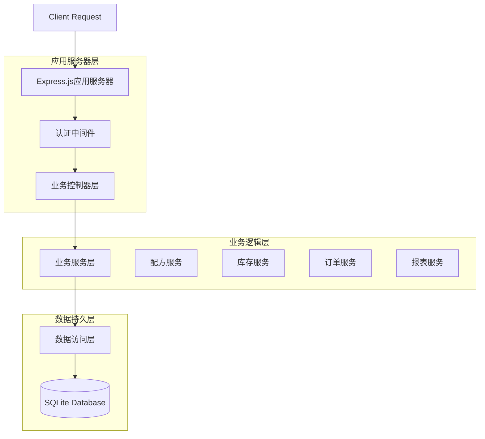
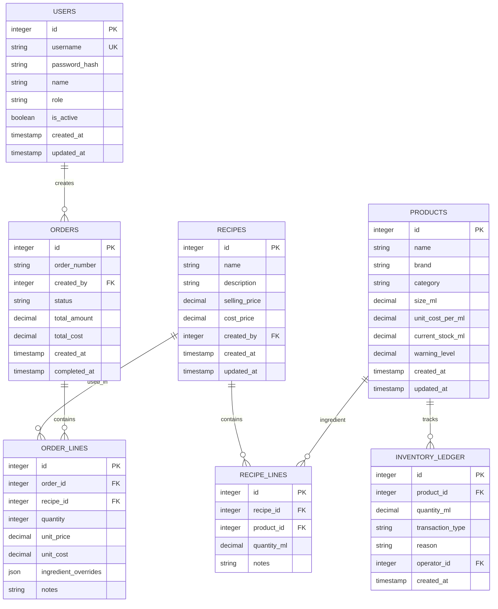

# 调酒师酒吧管理系统技术架构文档

## 1. Architecture design



## 2. Technology Description

- Frontend: React@19 + TypeScript@5 + Tailwind CSS@3 + Vite@7
- Backend: Express.js@4 + TypeScript@5 + JWT认证 + bcrypt加密
- Database: SQLite@3 + 原生SQL查询
- 开发工具: ESLint + Prettier + Hot Reload
- 部署: Node.js + PM2 进程管理

## 3. Route definitions

| Route | Purpose |
|-------|---------|
| / | 重定向到仪表板页面 |
| /login | 登录页面，用户名密码登录 |
| /dashboard | 首页仪表板，显示销售概览和快速操作入口 |
| /recipes | 配方管理页面，配方的增删改查和成本计算 |
| /orders | 订单处理页面，订单管理和处理功能 |
| /inventory | 库存管理页面，库存查询和出入库操作 |
| /reports | 销售报表页面，销量统计和利润分析 |
| /settings | 系统设置页面，用户管理和系统配置 |

## 4. API definitions

### 4.1 Core API

**用户认证相关**
```
POST /api/auth/login
```

Request:
| Param Name | Param Type | isRequired | Description |
|------------|------------|------------|-------------|
| username | string | true | 用户名 |
| password | string | true | 密码 |

Response:
| Param Name | Param Type | Description |
|------------|------------|-------------|
| success | boolean | 登录是否成功 |
| token | string | JWT访问令牌 |
| user | object | 用户信息对象 |

**配方管理相关**
```
GET /api/recipes - 获取配方列表
POST /api/recipes - 创建新配方
PUT /api/recipes/:id - 更新配方
DELETE /api/recipes/:id - 删除配方
```

**库存管理相关**
```
GET /api/inventory - 获取库存列表
POST /api/inventory/adjust - 库存调整
PUT /api/inventory/:id - 更新库存信息
```

**订单处理相关**
```
POST /api/orders - 创建订单
PUT /api/orders/:id/complete - 完成订单
GET /api/orders - 获取订单历史
```

**报表分析相关**
```
GET /api/reports/sales - 销售统计
GET /api/reports/profit - 利润分析
```

Example Request:
```json
{
  "username": "bartender01",
  "password": "securePassword123"
}
```

Example Response:
```json
{
  "success": true,
  "token": "eyJhbGciOiJIUzI1NiIsInR5cCI6IkpXVCJ9...",
  "user": {
    "id": "user_123",
    "username": "bartender01",
    "role": "bartender",
    "name": "张调酒师"
  }
}
```

## 5. Server architecture diagram



## 6. Data model

### 6.1 Data model definition



### 6.2 Data Definition Language

**用户表 (users)**
```sql
-- 创建用户表
CREATE TABLE users (
    id INTEGER PRIMARY KEY AUTOINCREMENT,
    username VARCHAR(50) UNIQUE NOT NULL,
    password_hash VARCHAR(255) NOT NULL,
    name VARCHAR(100) NOT NULL,
    role VARCHAR(20) NOT NULL CHECK (role IN ('owner', 'bartender')),
    is_active BOOLEAN DEFAULT 1,
    created_at DATETIME DEFAULT CURRENT_TIMESTAMP,
    updated_at DATETIME DEFAULT CURRENT_TIMESTAMP
);

-- 创建索引
CREATE INDEX idx_users_username ON users(username);
```

**产品表 (products)**
```sql
-- 创建产品表
CREATE TABLE products (
    id INTEGER PRIMARY KEY AUTOINCREMENT,
    name VARCHAR(200) NOT NULL,
    brand VARCHAR(100),
    category VARCHAR(50) NOT NULL,
    size_ml DECIMAL(10,2) NOT NULL,
    unit_cost_per_ml DECIMAL(10,4) NOT NULL,
    current_stock_ml DECIMAL(10,2) DEFAULT 0,
    warning_level DECIMAL(10,2) DEFAULT 0,
    created_at DATETIME DEFAULT CURRENT_TIMESTAMP,
    updated_at DATETIME DEFAULT CURRENT_TIMESTAMP
);

-- 创建索引
CREATE INDEX idx_products_category ON products(category);
CREATE INDEX idx_products_stock_level ON products(current_stock_ml);
```

**配方表 (recipes)**
```sql
-- 创建配方表
CREATE TABLE recipes (
    id INTEGER PRIMARY KEY AUTOINCREMENT,
    name VARCHAR(200) NOT NULL,
    description TEXT,
    selling_price DECIMAL(10,2) NOT NULL,
    cost_price DECIMAL(10,4) DEFAULT 0,
    created_by INTEGER REFERENCES users(id),
    created_at DATETIME DEFAULT CURRENT_TIMESTAMP,
    updated_at DATETIME DEFAULT CURRENT_TIMESTAMP
);

-- 创建索引
CREATE INDEX idx_recipes_name ON recipes(name);
```

**库存流水表 (inventory_ledger)**
```sql
-- 创建库存流水表
CREATE TABLE inventory_ledger (
    id INTEGER PRIMARY KEY AUTOINCREMENT,
    product_id INTEGER REFERENCES products(id),
    quantity_ml DECIMAL(10,2) NOT NULL,
    transaction_type VARCHAR(20) NOT NULL CHECK (transaction_type IN ('in', 'out', 'adjust')),
    reason VARCHAR(200),
    operator_id INTEGER REFERENCES users(id),
    created_at DATETIME DEFAULT CURRENT_TIMESTAMP
);

-- 创建索引
CREATE INDEX idx_inventory_ledger_product ON inventory_ledger(product_id);
CREATE INDEX idx_inventory_ledger_date ON inventory_ledger(created_at DESC);
```

**配方行表 (recipe_lines)**
```sql
-- 创建配方行表
CREATE TABLE recipe_lines (
    id INTEGER PRIMARY KEY AUTOINCREMENT,
    recipe_id INTEGER REFERENCES recipes(id),
    product_id INTEGER REFERENCES products(id),
    quantity_ml DECIMAL(10,2) NOT NULL,
    notes TEXT
);

-- 创建索引
CREATE INDEX idx_recipe_lines_recipe ON recipe_lines(recipe_id);
```

**订单表 (orders)**
```sql
-- 创建订单表
CREATE TABLE orders (
    id INTEGER PRIMARY KEY AUTOINCREMENT,
    order_number VARCHAR(50) NOT NULL,
    created_by INTEGER REFERENCES users(id),
    status VARCHAR(20) DEFAULT 'pending',
    total_amount DECIMAL(10,2) NOT NULL,
    total_cost DECIMAL(10,2) NOT NULL,
    created_at DATETIME DEFAULT CURRENT_TIMESTAMP,
    completed_at DATETIME
);

-- 创建索引
CREATE INDEX idx_orders_date ON orders(created_at DESC);
```

**订单行表 (order_lines)**
```sql
-- 创建订单行表
CREATE TABLE order_lines (
    id INTEGER PRIMARY KEY AUTOINCREMENT,
    order_id INTEGER REFERENCES orders(id),
    recipe_id INTEGER REFERENCES recipes(id),
    quantity INTEGER NOT NULL,
    unit_price DECIMAL(10,2) NOT NULL,
    unit_cost DECIMAL(10,2) NOT NULL,
    ingredient_overrides TEXT,
    notes TEXT
);

-- 创建索引
CREATE INDEX idx_order_lines_order ON order_lines(order_id);
```

**初始化数据**
```sql
-- 插入默认管理员用户
INSERT INTO users (username, password_hash, name, role) VALUES 
('admin', '$2b$10$encrypted_password_hash', '系统管理员', 'owner');

-- 插入基础产品分类
INSERT INTO products (name, brand, category, size_ml, unit_cost_per_ml, warning_level) VALUES 
('威士忌', 'Jack Daniels', '基酒', 750.00, 0.08, 1500.00),
('伏特加', 'Absolut', '基酒', 750.00, 0.06, 1500.00),
('朗姆酒', 'Bacardi', '基酒', 750.00, 0.07, 1500.00),
('金酒', 'Bombay', '基酒', 750.00, 0.09, 1500.00),
('柠檬汁', '鲜榨', '辅料', 1000.00, 0.01, 500.00),
('糖浆', '自制', '辅料', 500.00, 0.005, 250.00);

-- 插入示例配方
INSERT INTO recipes (name, description, selling_price, created_by) VALUES 
('Old Fashioned', '经典威士忌鸡尾酒', 68.00, 1),
('Mojito', '古巴经典朗姆酒鸡尾酒', 58.00, 1);

-- 插入配方行数据
INSERT INTO recipe_lines (recipe_id, product_id, quantity_ml, notes) VALUES 
(1, 1, 60.0, '威士忌基酒'),
(1, 6, 10.0, '糖浆调味'),
(2, 3, 50.0, '朗姆酒基酒'),
(2, 5, 20.0, '柠檬汁'),
(2, 6, 15.0, '糖浆');
```