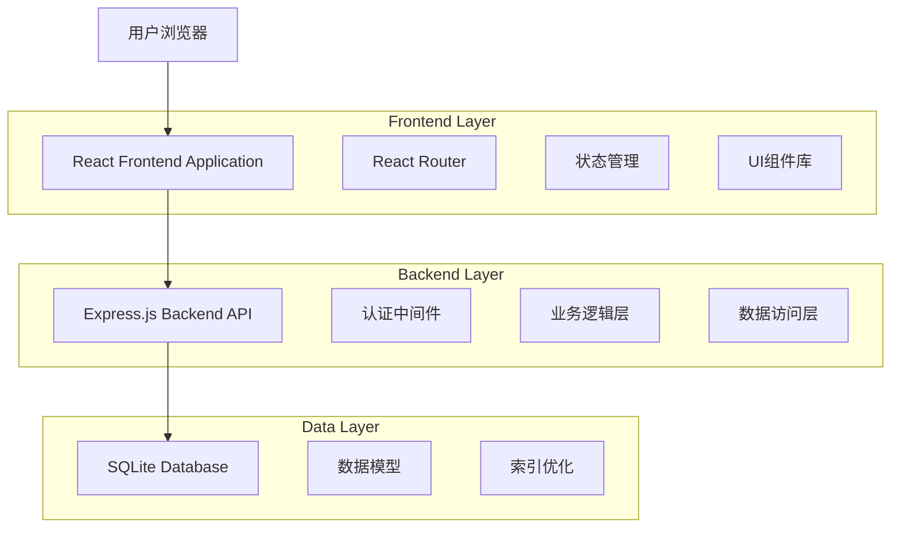
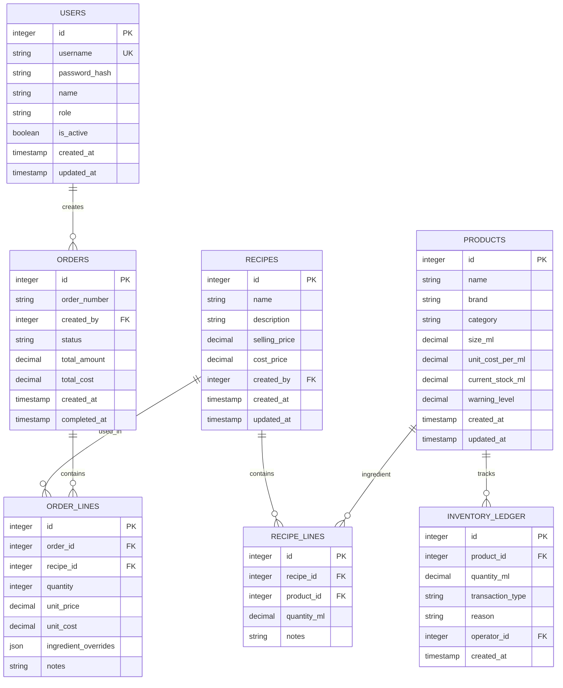
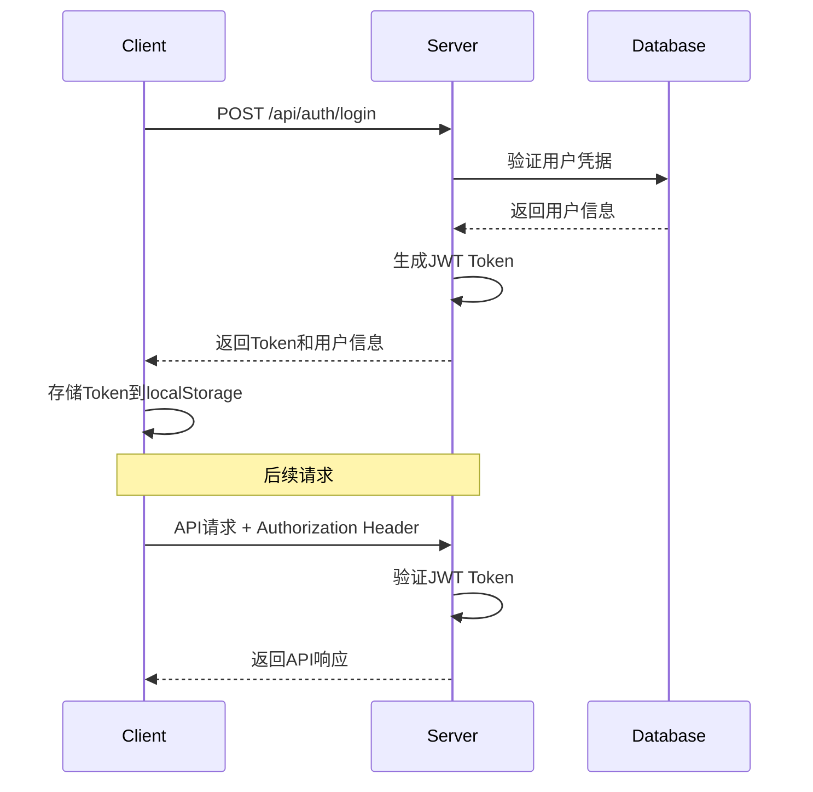

# 调酒师酒吧管理系统详细技术文档

## 1. 系统架构设计

### 1.1 整体架构

本系统采用前后端分离的三层架构设计，包括表现层、业务逻辑层和数据持久层。



### 1.2 架构特点

- **前后端分离**：前端React应用与后端Express API完全解耦
- **RESTful API**：标准化的HTTP接口设计
- **JWT认证**：无状态的用户认证机制
- **轻量级数据库**：SQLite适合小型应用的数据存储需求
- **响应式设计**：支持桌面端和移动端访问

## 2. 技术选型和依赖说明

### 2.1 前端技术栈

| 技术 | 版本 | 用途 | 选型理由 |
|------|------|------|----------|
| React | 19.x | 前端框架 | 组件化开发，生态丰富，最新特性 |
| TypeScript | 5.x | 类型系统 | 提供类型安全，减少运行时错误 |
| Vite | 7.x | 构建工具 | 快速的开发服务器和构建性能 |
| Tailwind CSS | 3.x | CSS框架 | 原子化CSS，快速样式开发 |
| React Router | 6.x | 路由管理 | 声明式路由，支持嵌套路由 |
| Axios | 1.x | HTTP客户端 | 请求拦截器，错误处理 |
| React Context | 内置 | 状态管理 | 轻量级状态管理，React原生支持 |

### 2.2 后端技术栈

| 技术 | 版本 | 用途 | 选型理由 |
|------|------|------|----------|
| Node.js | 22.x | 运行环境 | JavaScript全栈开发，性能优秀 |
| Express.js | 4.x | Web框架 | 轻量级，中间件丰富 |
| TypeScript | 5.x | 类型系统 | 提供类型安全，提升代码质量 |
| SQLite | 3.x | 数据库 | 轻量级，无需额外配置 |
| 原生SQL | - | 数据访问 | 直接SQL查询，性能优化 |
| jsonwebtoken | 9.x | JWT认证 | 无状态认证，安全可靠 |
| bcrypt | 5.x | 密码加密 | 安全的密码哈希算法 |
| cors | 2.x | 跨域处理 | 处理前后端跨域请求 |

### 2.3 开发工具

- **包管理器**：npm/pnpm
- **代码格式化**：Prettier
- **代码检查**：ESLint
- **版本控制**：Git
- **API测试**：Postman/Thunder Client

## 3. 数据库设计和模型关系

### 3.1 数据模型概览



### 3.2 核心表设计

#### 用户表 (users)
```sql
CREATE TABLE users (
    id INTEGER PRIMARY KEY AUTOINCREMENT,
    username VARCHAR(50) UNIQUE NOT NULL,
    password_hash VARCHAR(255) NOT NULL,
    name VARCHAR(100) NOT NULL,
    role VARCHAR(20) NOT NULL CHECK (role IN ('owner', 'bartender')),
    is_active BOOLEAN DEFAULT 1,
    created_at DATETIME DEFAULT CURRENT_TIMESTAMP,
    updated_at DATETIME DEFAULT CURRENT_TIMESTAMP
);
```

#### 产品表 (products)
```sql
CREATE TABLE products (
    id INTEGER PRIMARY KEY AUTOINCREMENT,
    name VARCHAR(200) NOT NULL,
    brand VARCHAR(100),
    category VARCHAR(50) NOT NULL,
    size_ml DECIMAL(10,2) NOT NULL,
    unit_cost_per_ml DECIMAL(10,4) NOT NULL,
    current_stock_ml DECIMAL(10,2) DEFAULT 0,
    warning_level DECIMAL(10,2) DEFAULT 0,
    created_at DATETIME DEFAULT CURRENT_TIMESTAMP,
    updated_at DATETIME DEFAULT CURRENT_TIMESTAMP
);
```

### 3.3 索引优化策略

```sql
-- 用户表索引
CREATE INDEX idx_users_username ON users(username);

-- 产品表索引
CREATE INDEX idx_products_category ON products(category);
CREATE INDEX idx_products_stock_level ON products(current_stock_ml);

-- 配方表索引
CREATE INDEX idx_recipes_name ON recipes(name);

-- 库存流水表索引
CREATE INDEX idx_inventory_ledger_product ON inventory_ledger(product_id);
CREATE INDEX idx_inventory_ledger_date ON inventory_ledger(created_at DESC);

-- 订单表索引
CREATE INDEX idx_orders_date ON orders(created_at DESC);
```

## 4. API接口完整规范

### 4.1 接口设计原则

- **RESTful风格**：使用标准HTTP方法和状态码
- **统一响应格式**：所有接口返回统一的JSON格式
- **错误处理**：详细的错误信息和错误码
- **认证授权**：JWT Token认证机制
- **参数验证**：严格的输入参数验证

### 4.2 通用响应格式

```typescript
interface ApiResponse<T> {
  success: boolean;
  data?: T;
  message?: string;
  error?: {
    code: string;
    message: string;
    details?: any;
  };
}
```

### 4.3 认证接口

#### 用户登录
```
POST /api/auth/login
```

**请求参数：**
```json
{
  "username": "admin",
  "password": "admin123"
}
```

**响应示例：**
```json
{
  "success": true,
  "data": {
    "token": "eyJhbGciOiJIUzI1NiIsInR5cCI6IkpXVCJ9...",
    "user": {
      "id": 1,
      "username": "admin",
      "name": "系统管理员",
      "role": "owner"
    }
  },
  "message": "登录成功"
}
```

#### 获取当前用户信息
```
GET /api/auth/me
Authorization: Bearer <token>
```

### 4.4 配方管理接口

#### 获取配方列表
```
GET /api/recipes
Authorization: Bearer <token>
```

**查询参数：**
- `page`: 页码（默认1）
- `limit`: 每页数量（默认20）
- `search`: 搜索关键词
- `category`: 分类筛选

#### 创建配方
```
POST /api/recipes
Authorization: Bearer <token>
```

**请求参数：**
```json
{
  "name": "Old Fashioned",
  "description": "经典威士忌鸡尾酒",
  "selling_price": 68.00,
  "ingredients": [
    {
      "product_id": 1,
      "quantity_ml": 60.0,
      "notes": "威士忌基酒"
    },
    {
      "product_id": 6,
      "quantity_ml": 10.0,
      "notes": "糖浆调味"
    }
  ]
}
```

### 4.5 库存管理接口

#### 获取库存列表
```
GET /api/inventory
Authorization: Bearer <token>
```

#### 库存调整
```
POST /api/inventory/adjust
Authorization: Bearer <token>
```

**请求参数：**
```json
{
  "product_id": 1,
  "quantity_ml": 500.0,
  "transaction_type": "in",
  "reason": "新进货"
}
```

### 4.6 订单处理接口

#### 创建订单
```
POST /api/orders
Authorization: Bearer <token>
```

**请求参数：**
```json
{
  "items": [
    {
      "recipe_id": 1,
      "quantity": 2,
      "ingredient_overrides": {
        "1": {
          "product_id": 2,
          "notes": "替换为高端威士忌"
        }
      },
      "notes": "少冰"
    }
  ]
}
```

### 4.7 报表分析接口

#### 销售统计
```
GET /api/reports/sales
Authorization: Bearer <token>
```

**查询参数：**
- `start_date`: 开始日期
- `end_date`: 结束日期
- `group_by`: 分组方式（day/week/month）

## 5. 前端组件架构

### 5.1 组件层次结构

```
src/
├── components/           # 通用组件
│   ├── ui/              # 基础UI组件
│   │   ├── Button.tsx
│   │   ├── Input.tsx
│   │   ├── Modal.tsx
│   │   └── Table.tsx
│   ├── layout/          # 布局组件
│   │   ├── Header.tsx
│   │   ├── Sidebar.tsx
│   │   └── Layout.tsx
│   └── business/        # 业务组件
│       ├── RecipeCard.tsx
│       ├── CreateRecipeModal.tsx  # 新建配方模态框
│       ├── OrderItem.tsx
│       └── InventoryAlert.tsx
├── pages/               # 页面组件
│   ├── Dashboard.tsx
│   ├── Login.tsx
│   ├── Recipes.tsx
│   ├── Orders.tsx
│   ├── Inventory.tsx
│   └── Reports.tsx
├── hooks/               # 自定义Hook
│   ├── useAuth.ts
│   ├── useApi.ts
│   └── useLocalStorage.ts
├── contexts/            # React Context
│   ├── AuthContext.tsx
│   └── ThemeContext.tsx
├── utils/               # 工具函数
│   ├── api.ts
│   ├── format.ts
│   └── validation.ts
└── types/               # TypeScript类型定义
    ├── api.ts
    ├── user.ts
    └── recipe.ts
```

### 5.2 状态管理策略

#### 全局状态（Zustand）
```typescript
interface AppState {
  user: User | null;
  isAuthenticated: boolean;
  theme: 'light' | 'dark';
  notifications: Notification[];
}

interface AppActions {
  setUser: (user: User | null) => void;
  setTheme: (theme: 'light' | 'dark') => void;
  addNotification: (notification: Notification) => void;
  removeNotification: (id: string) => void;
}
```

#### 本地状态（useState/useReducer）
- 表单状态
- 组件内部状态
- 临时UI状态

### 5.3 路由配置

```typescript
const router = createBrowserRouter([
  {
    path: "/",
    element: <Layout />,
    children: [
      {
        index: true,
        element: <Dashboard />
      },
      {
        path: "recipes",
        element: <Recipes />
      },
      {
        path: "recipes/:id",
        element: <RecipeDetail />
      },
      {
        path: "orders",
        element: <Orders />
      },
      {
        path: "orders/new",
        element: <NewOrder />
      },
      {
        path: "inventory",
        element: <Inventory />
      },
      {
        path: "reports",
        element: <Reports />
      }
    ]
  },
  {
    path: "/login",
    element: <Login />
  }
]);
```

## 6. 安全机制和认证流程

### 6.1 认证流程



### 6.2 JWT Token结构

```typescript
interface JWTPayload {
  userId: number;
  username: string;
  role: 'owner' | 'bartender';
  iat: number;  // 签发时间
  exp: number;  // 过期时间
}
```

### 6.3 安全措施

#### 密码安全
- 使用bcrypt进行密码哈希
- 最小密码强度要求
- 防止密码明文传输

```typescript
// 密码加密
const hashPassword = async (password: string): Promise<string> => {
  const saltRounds = 10;
  return await bcrypt.hash(password, saltRounds);
};

// 密码验证
const verifyPassword = async (password: string, hash: string): Promise<boolean> => {
  return await bcrypt.compare(password, hash);
};
```

#### API安全
- JWT Token认证
- CORS配置
- 请求频率限制
- 输入参数验证

```typescript
// JWT中间件
const authenticateToken = (req: Request, res: Response, next: NextFunction) => {
  const authHeader = req.headers['authorization'];
  const token = authHeader && authHeader.split(' ')[1];
  
  if (!token) {
    return res.status(401).json({ error: 'Access token required' });
  }
  
  jwt.verify(token, process.env.JWT_SECRET!, (err, user) => {
    if (err) {
      return res.status(403).json({ error: 'Invalid token' });
    }
    req.user = user;
    next();
  });
};
```

### 6.4 权限控制

#### 角色权限矩阵

| 功能模块 | 老板/店长 | 调酒师 |
|----------|-----------|--------|
| 配方管理 | 增删改查 | 查看 |
| 订单处理 | 增删改查 | 增改查 |
| 库存管理 | 增删改查 | 查看 |
| 销售报表 | 查看 | 无权限 |
| 用户管理 | 增删改查 | 无权限 |

## 6.5 新建配方功能详细设计

### 6.5.1 功能概述

新建配方功能是配方管理模块的核心功能之一，允许用户通过直观的分步式界面创建新的鸡尾酒配方。该功能采用模态弹窗设计，提供完整的配方创建流程。

### 6.5.2 组件架构

```typescript
// CreateRecipeModal.tsx - 主组件
interface CreateRecipeModalProps {
  isOpen: boolean;
  onClose: () => void;
  onSave: (recipe: RecipeFormData) => Promise<void>;
}

// 配方表单数据结构
interface RecipeFormData {
  name: string;
  description: string;
  category: string;
  preparationTime: number;
  difficulty: 'easy' | 'medium' | 'hard';
  cost: number;
  price: number;
  ingredients: Ingredient[];
  instructions: string[];
  isActive: boolean;
}

// 原料数据结构
interface Ingredient {
  id: string;
  name: string;
  brand: string;
  amount: number;
  unit: string;
  cost: number;
}
```

### 6.5.3 核心功能特性

#### 分步式界面设计
1. **步骤1：基本信息**
   - 配方名称、描述、分类
   - 制作时间、难度、售价
   - 实时成本计算和利润率显示

2. **步骤2：原料配比**
   - 动态原料列表管理
   - 支持添加/删除原料
   - 原料信息：名称、品牌、用量、单位、成本
   - 自动成本汇总计算

3. **步骤3：制作步骤**
   - 多步骤制作说明编辑
   - 支持步骤排序（上移/下移）
   - 步骤添加/删除功能

#### 表单验证机制
```typescript
const validateForm = (): boolean => {
  const newErrors: FormErrors = {};
  
  // 基本信息验证
  if (!formData.name.trim()) {
    newErrors.name = '配方名称不能为空';
  }
  
  // 价格验证
  if (formData.price <= formData.cost) {
    newErrors.price = '售价应高于成本';
  }
  
  // 原料验证
  if (formData.ingredients.length === 0) {
    newErrors.ingredients = '至少需要添加一种原料';
  }
  
  return Object.keys(newErrors).length === 0;
};
```

#### 实时计算功能
- **成本自动计算**：根据原料成本自动计算总成本
- **利润率显示**：实时显示利润率并用颜色区分盈利水平
- **数据同步**：表单数据变更时自动更新相关计算

### 6.5.4 API集成

#### 创建配方API调用
```typescript
const handleSaveRecipe = async (recipeData: RecipeFormData) => {
  try {
    const response = await recipeAPI.createRecipe(recipeData);
    
    if (response.data.success) {
      // 重新加载配方列表
      const recipesResponse = await recipeAPI.getRecipes();
      if (recipesResponse.data.success) {
        setRecipes(recipesResponse.data.recipes);
      }
    }
  } catch (error) {
    // 错误处理和本地模拟后备方案
    console.error('创建配方失败:', error);
  }
};
```

#### 错误处理策略
- **网络错误**：提供本地模拟创建功能
- **验证错误**：实时表单验证反馈
- **服务器错误**：友好的错误提示信息

### 6.5.5 用户体验设计

#### 响应式设计
- 支持桌面端和移动端访问
- 自适应布局调整
- 触摸友好的交互设计

#### 交互反馈
- 加载状态指示器
- 保存进度提示
- 操作成功/失败反馈
- 表单验证实时提示

#### 数据持久化
- 表单数据临时保存
- 意外关闭时的数据恢复
- 重置功能快速清空表单

### 6.5.6 扩展性设计

#### 组件复用
- 模态框组件可复用于编辑配方
- 表单验证逻辑可扩展到其他表单
- 原料管理组件可独立使用

#### 功能扩展
- 支持配方模板功能
- 批量导入配方
- 配方复制和变体创建
- 营养成分计算

## 7. 性能优化策略

### 7.1 前端性能优化

#### 代码分割
```typescript
// 路由级别的代码分割
const Dashboard = lazy(() => import('../pages/Dashboard'));
const Recipes = lazy(() => import('../pages/Recipes'));
const Orders = lazy(() => import('../pages/Orders'));
```

#### 组件优化
```typescript
// 使用React.memo优化组件渲染
const RecipeCard = React.memo(({ recipe }: { recipe: Recipe }) => {
  return (
    <div className="recipe-card">
      {/* 组件内容 */}
    </div>
  );
});

// 使用useMemo优化计算
const expensiveValue = useMemo(() => {
  return calculateRecipeCost(recipe.ingredients);
}, [recipe.ingredients]);
```

#### 数据缓存
```typescript
// 使用React Query进行数据缓存
const { data: recipes, isLoading } = useQuery({
  queryKey: ['recipes'],
  queryFn: fetchRecipes,
  staleTime: 5 * 60 * 1000, // 5分钟
});
```

### 7.2 后端性能优化

#### 数据库优化
- 合理使用索引
- 查询优化
- 连接池配置

```typescript
// 数据库连接池配置
const sequelize = new Sequelize({
  dialect: 'sqlite',
  storage: 'database.sqlite',
  pool: {
    max: 5,
    min: 0,
    acquire: 30000,
    idle: 10000
  },
  logging: false
});
```

#### API响应优化
```typescript
// 分页查询
const getRecipes = async (page: number = 1, limit: number = 20) => {
  const offset = (page - 1) * limit;
  return await Recipe.findAndCountAll({
    limit,
    offset,
    include: [{
      model: RecipeLine,
      include: [Product]
    }]
  });
};
```

### 7.3 缓存策略

#### 浏览器缓存
- 静态资源缓存
- API响应缓存
- 本地存储缓存

#### 服务端缓存
- 内存缓存（Redis可选）
- 查询结果缓存
- 计算结果缓存

## 8. 代码规范和开发指南

### 8.1 TypeScript规范

#### 类型定义
```typescript
// 接口定义
interface User {
  id: number;
  username: string;
  name: string;
  role: 'owner' | 'bartender';
  isActive: boolean;
  createdAt: Date;
  updatedAt: Date;
}

// 类型别名
type UserRole = 'owner' | 'bartender';
type ApiResponse<T> = {
  success: boolean;
  data?: T;
  message?: string;
  error?: ApiError;
};
```

#### 函数类型
```typescript
// 函数签名
type CreateRecipeHandler = (
  data: CreateRecipeRequest
) => Promise<ApiResponse<Recipe>>;

// 泛型函数
const createApiHandler = <T, R>(
  handler: (data: T) => Promise<R>
) => {
  return async (req: Request, res: Response) => {
    try {
      const result = await handler(req.body);
      res.json(result);
    } catch (error) {
      res.status(500).json({ error: error.message });
    }
  };
};
```

### 8.2 React组件规范

#### 组件结构
```typescript
// 组件Props接口
interface RecipeCardProps {
  recipe: Recipe;
  onEdit?: (recipe: Recipe) => void;
  onDelete?: (id: number) => void;
  className?: string;
}

// 组件实现
const RecipeCard: React.FC<RecipeCardProps> = ({
  recipe,
  onEdit,
  onDelete,
  className
}) => {
  // 组件逻辑
  const handleEdit = useCallback(() => {
    onEdit?.(recipe);
  }, [recipe, onEdit]);

  // 组件渲染
  return (
    <div className={cn('recipe-card', className)}>
      {/* 组件内容 */}
    </div>
  );
};

export default RecipeCard;
```

### 8.3 API设计规范

#### 控制器结构
```typescript
class RecipeController {
  async getRecipes(req: Request, res: Response) {
    try {
      const { page = 1, limit = 20, search } = req.query;
      const recipes = await recipeService.getRecipes({
        page: Number(page),
        limit: Number(limit),
        search: search as string
      });
      
      res.json({
        success: true,
        data: recipes
      });
    } catch (error) {
      res.status(500).json({
        success: false,
        error: {
          code: 'INTERNAL_ERROR',
          message: error.message
        }
      });
    }
  }
}
```

### 8.4 错误处理规范

#### 错误类型定义
```typescript
class AppError extends Error {
  constructor(
    public code: string,
    public message: string,
    public statusCode: number = 500,
    public details?: any
  ) {
    super(message);
    this.name = 'AppError';
  }
}

// 具体错误类型
class ValidationError extends AppError {
  constructor(message: string, details?: any) {
    super('VALIDATION_ERROR', message, 400, details);
  }
}

class NotFoundError extends AppError {
  constructor(resource: string) {
    super('NOT_FOUND', `${resource} not found`, 404);
  }
}
```

#### 全局错误处理
```typescript
// Express错误处理中间件
const errorHandler = (
  error: Error,
  req: Request,
  res: Response,
  next: NextFunction
) => {
  if (error instanceof AppError) {
    return res.status(error.statusCode).json({
      success: false,
      error: {
        code: error.code,
        message: error.message,
        details: error.details
      }
    });
  }

  // 未知错误
  console.error('Unexpected error:', error);
  res.status(500).json({
    success: false,
    error: {
      code: 'INTERNAL_ERROR',
      message: 'Internal server error'
    }
  });
};
```

### 8.5 测试规范

#### 单元测试
```typescript
// 服务层测试
describe('RecipeService', () => {
  let recipeService: RecipeService;
  
  beforeEach(() => {
    recipeService = new RecipeService();
  });
  
  describe('createRecipe', () => {
    it('should create a recipe successfully', async () => {
      const recipeData = {
        name: 'Test Recipe',
        description: 'Test Description',
        sellingPrice: 50.00
      };
      
      const result = await recipeService.createRecipe(recipeData);
      
      expect(result).toBeDefined();
      expect(result.name).toBe(recipeData.name);
    });
  });
});
```

#### 集成测试
```typescript
// API测试
describe('Recipe API', () => {
  let app: Express;
  let authToken: string;
  
  beforeAll(async () => {
    app = createApp();
    authToken = await getAuthToken();
  });
  
  describe('POST /api/recipes', () => {
    it('should create a new recipe', async () => {
      const response = await request(app)
        .post('/api/recipes')
        .set('Authorization', `Bearer ${authToken}`)
        .send({
          name: 'Test Recipe',
          description: 'Test Description',
          sellingPrice: 50.00
        });
      
      expect(response.status).toBe(201);
      expect(response.body.success).toBe(true);
    });
  });
});
```

## 9. 部署和运维

### 9.1 环境配置

#### 环境变量
```bash
# .env.production
NODE_ENV=production
PORT=3001
JWT_SECRET=your-super-secret-jwt-key
DB_PATH=./data/production.sqlite
CORS_ORIGIN=https://yourdomain.com
```

#### PM2配置
```json
{
  "name": "bar-management-api",
  "script": "dist/server.js",
  "instances": 1,
  "exec_mode": "cluster",
  "env": {
    "NODE_ENV": "production",
    "PORT": 3001
  },
  "log_file": "./logs/app.log",
  "error_file": "./logs/error.log",
  "out_file": "./logs/out.log",
  "log_date_format": "YYYY-MM-DD HH:mm:ss"
}
```

### 9.2 监控和日志

#### 日志配置
```typescript
import winston from 'winston';

const logger = winston.createLogger({
  level: 'info',
  format: winston.format.combine(
    winston.format.timestamp(),
    winston.format.errors({ stack: true }),
    winston.format.json()
  ),
  transports: [
    new winston.transports.File({ filename: 'logs/error.log', level: 'error' }),
    new winston.transports.File({ filename: 'logs/combined.log' })
  ]
});

if (process.env.NODE_ENV !== 'production') {
  logger.add(new winston.transports.Console({
    format: winston.format.simple()
  }));
}
```

## 10. 总结

本技术文档详细描述了调酒师酒吧管理系统的技术架构、实现细节和开发规范。系统采用现代化的技术栈，具有良好的可扩展性和维护性。通过合理的架构设计和规范的开发流程，确保系统的稳定性和性能。

### 技术亮点
- 前后端分离架构，便于独立开发和部署
- TypeScript全栈开发，提供类型安全
- RESTful API设计，标准化接口规范
- JWT认证机制，安全可靠
- 响应式设计，支持多端访问
- 轻量级数据库，适合小型应用

### 扩展性考虑
- 模块化设计，便于功能扩展
- 标准化的API接口，支持第三方集成
- 灵活的权限系统，支持角色扩展
- 可配置的业务规则，适应不同需求