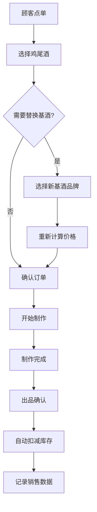
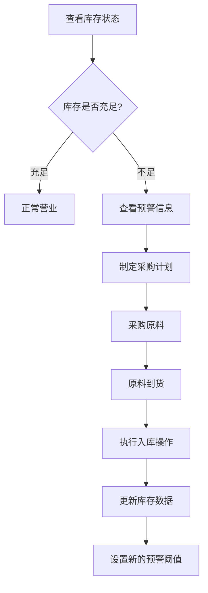
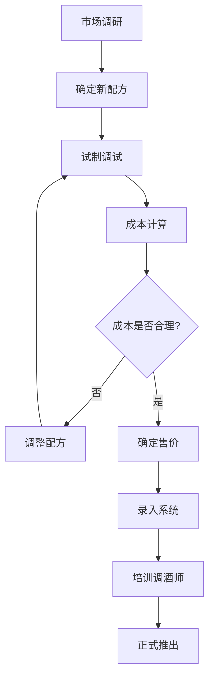

# 调酒师酒吧管理系统用户使用手册

## 1. 产品功能概览

### 1.1 系统简介

调酒师酒吧管理系统是一款专为小酒馆设计的轻量级管理工具，帮助酒吧经营者和调酒师高效管理日常业务。系统提供配方管理、订单处理、库存跟踪和销售统计等核心功能，让您的酒吧经营更加专业化和数字化。

### 1.2 核心功能模块

| 功能模块 | 主要功能 | 适用人员 |
|----------|----------|----------|
| 首页仪表板 | 销售概览、库存预警、快速操作 | 所有用户 |
| 配方管理 | 配方录入、成本计算、配方搜索 | 老板/店长 |
| 订单处理 | 点单界面、基酒替换、出品确认 | 调酒师 |
| 库存管理 | 库存查询、入库出库、预警设置 | 老板/店长 |
| 销售报表 | 销量统计、利润分析、数据导出 | 老板/店长 |

### 1.3 系统特色

- **简单易用**：直观的界面设计，快速上手
- **专业配方管理**：精确的成本计算和配方标准化
- **灵活基酒替换**：支持不同品牌基酒的实时替换和价格计算
- **实时库存跟踪**：自动库存扣减和预警提醒
- **数据统计分析**：清晰的销售报表和利润分析

## 2. 用户角色和权限说明

### 2.1 用户角色定义

#### 老板/店长 (Owner)
- **权限范围**：系统全部功能
- **主要职责**：
  - 管理鸡尾酒配方和定价
  - 设置库存预警和管理库存
  - 查看销售报表和利润分析
  - 管理调酒师账号
  - 处理库存入库和调整

#### 调酒师 (Bartender)
- **权限范围**：订单处理、配方查看、库存查询
- **主要职责**：
  - 处理顾客订单
  - 查看配方信息和制作要求
  - 根据需要替换基酒品牌
  - 确认出品完成

### 2.2 权限矩阵

| 功能 | 老板/店长 | 调酒师 | 说明 |
|------|-----------|--------|---------|
| 首页仪表板 | ✅ | ✅ | 查看销售概览和库存状态 |
| 配方管理 | ✅ | 🔍 | 老板可增删改，调酒师只能查看 |
| 订单处理 | ✅ | ✅ | 都可以处理订单 |
| 库存管理 | ✅ | 🔍 | 老板可管理，调酒师只能查询 |
| 销售报表 | ✅ | ❌ | 仅老板可查看 |
| 用户管理 | ✅ | ❌ | 仅老板可管理 |

*图例：✅ 完全权限，🔍 只读权限，❌ 无权限*

## 3. 系统登录和基础操作

### 3.1 首次登录

1. **打开系统**
   - 在浏览器中输入系统地址
   - 系统会自动跳转到登录页面

2. **使用默认账号登录**
   - 用户名：`admin`
   - 密码：`admin123`
   - 点击「登录」按钮

3. **修改默认密码**（强烈建议）
   - 登录后点击右上角用户头像
   - 选择「修改密码」
   - 输入新密码并确认

### 3.2 界面布局说明

```
┌─────────────────────────────────────────────────────────┐
│  🍸 调酒师酒吧管理系统        👤 用户名 ⚙️ 设置 🚪 退出  │
├─────────────────────────────────────────────────────────┤
│ 📊 首页 │ 📋 配方 │ 🛒 订单 │ 📦 库存 │ 📈 报表 │      │
├─────────────────────────────────────────────────────────┤
│                                                         │
│                    主要内容区域                          │
│                                                         │
│                                                         │
└─────────────────────────────────────────────────────────┘
```

- **顶部导航栏**：显示系统名称和用户信息
- **功能菜单栏**：快速切换各个功能模块
- **主要内容区域**：显示当前页面的具体内容

### 3.3 基础操作说明

#### 通用操作
- **搜索**：在搜索框中输入关键词，按回车或点击搜索按钮
- **筛选**：使用下拉菜单选择筛选条件
- **排序**：点击表格列标题进行排序
- **分页**：使用底部分页控件浏览更多数据

#### 表单操作
- **必填字段**：标有红色星号(*)的字段为必填
- **保存**：填写完成后点击「保存」按钮
- **取消**：点击「取消」按钮放弃当前操作
- **重置**：点击「重置」按钮清空表单内容

## 4. 详细功能操作指南

### 4.1 首页仪表板

#### 4.1.1 销售概览

首页显示今日关键经营指标：

- **今日销售额**：当天总收入
- **今日订单数**：当天完成的订单数量
- **热销产品**：销量排名前5的鸡尾酒
- **平均客单价**：今日平均每单金额

#### 4.1.2 库存预警

系统会自动检测库存不足的原料：

- **红色警告**：库存低于预警线的原料
- **黄色提醒**：库存接近预警线的原料
- **绿色正常**：库存充足的原料

**操作步骤：**
1. 查看预警列表中的原料
2. 点击原料名称查看详细信息
3. 点击「补货提醒」设置采购计划

#### 4.1.3 快速操作

提供常用功能的快速入口：

- **快速下单**：直接跳转到订单处理页面
- **库存查询**：快速查看库存状态
- **配方搜索**：搜索特定配方
- **今日报表**：查看当天销售数据

### 4.2 配方管理

#### 4.2.1 查看配方列表

**功能说明：**
- 显示所有鸡尾酒配方
- 支持按名称、原料、价格等条件搜索
- 显示配方成本和售价信息

**操作步骤：**
1. 点击导航栏「配方」进入配方管理页面
2. 使用搜索框查找特定配方
3. 使用筛选条件缩小搜索范围
4. 点击配方名称查看详细信息

#### 4.2.2 创建新配方（分步式界面）

**功能概述：**
新建配方功能采用分步式界面设计，引导用户逐步完成配方创建，确保信息完整准确。

**操作步骤：**

**第一步：基本信息设置**
1. 点击「新建配方」按钮，打开创建配方弹窗
2. 填写配方基本信息：
   - **配方名称**：输入鸡尾酒名称（必填，至少2个字符）
   - **配方描述**：详细描述配方特色和口感（必填）
   - **分类**：从下拉菜单选择酒类分类（朗姆酒类、威士忌类、伏特加类等）
   - **制作时间**：输入预计制作时间（1-60分钟）
   - **制作难度**：选择简单/中等/困难
   - **售价**：设置对外销售价格（必须大于0）
3. 系统实时显示预估成本、售价和利润率
4. 点击「下一步」进入原料配比设置

**第二步：原料配比管理**
1. 点击「添加原料」按钮添加配方原料
2. 为每个原料填写详细信息：
   - **原料名称**：如"白朗姆酒"、"新鲜薄荷叶"
   - **品牌**：具体品牌名称，如"Bacardi"、"本地采购"
   - **用量**：精确的用量数值
   - **单位**：选择合适的单位（ml、cl、oz、片、个、dash等）
   - **成本**：单次使用的原料成本
3. 系统自动计算总成本并更新利润率
4. 可以删除不需要的原料或调整原料顺序
5. 点击「下一步」进入制作步骤编辑

**第三步：制作步骤编辑**
1. 点击「添加步骤」按钮添加制作说明
2. 为每个步骤输入详细的制作说明
3. 使用上移/下移按钮调整步骤顺序
4. 可以删除不需要的步骤
5. 确保制作步骤完整清晰
6. 点击「保存配方」完成创建

**操作提示：**
- 🔴 红色星号(*)标记的字段为必填项
- 💡 系统会实时计算成本和利润率
- ⚠️ 售价必须高于成本才能保存
- 🔄 可以随时点击「重置」清空表单
- ❌ 点击「取消」放弃当前操作

**示例：创建Old Fashioned配方**
```
配方名称：Old Fashioned
描述：经典威士忌鸡尾酒，口感醇厚
售价：68.00元

原料清单：
- 威士忌（Jack Daniels）：60ml
- 糖浆（自制）：10ml
- 苦精：2-3滴
- 橙皮：装饰用

计算成本：5.8元
毛利率：91.5%
```

#### 4.2.3 编辑配方

**操作步骤：**
1. 在配方列表中找到要编辑的配方
2. 点击「编辑」按钮
3. 修改配方信息或原料清单
4. 系统重新计算成本
5. 点击「保存」确认修改

#### 4.2.4 成本计算说明

系统会根据原料单价和用量自动计算：

- **单杯成本** = Σ(原料单价 × 用量)
- **毛利率** = (售价 - 成本) ÷ 售价 × 100%
- **建议售价** = 成本 × 3-5倍（行业经验值）

### 4.3 订单处理

#### 4.3.1 创建新订单

**操作步骤：**
1. 点击导航栏「订单」进入订单处理页面
2. 点击「新建订单」按钮
3. 选择鸡尾酒：
   - 浏览配方列表
   - 使用搜索功能快速查找
   - 点击配方卡片添加到订单
4. 设置数量：
   - 使用 +/- 按钮调整数量
   - 或直接输入数量
5. 查看订单总价
6. 点击「确认订单」

#### 4.3.2 基酒替换功能

**使用场景：**
- 顾客要求使用特定品牌的基酒
- 原配方基酒库存不足
- 提供升级服务（使用高端基酒）

**操作步骤：**
1. 在订单中选择要替换基酒的鸡尾酒
2. 点击「替换基酒」按钮
3. 选择新的基酒品牌：
   - 系统显示可用的同类基酒
   - 显示价格差异
4. 确认替换：
   - 系统自动重新计算价格
   - 保持原料用量不变
5. 添加备注说明（可选）

**示例：威士忌替换**
```
原配方：Old Fashioned
原基酒：Jack Daniels（60ml）
替换为：Macallan 12年（60ml）

价格变化：
原价：68元
新价：128元
差价：+60元
```

#### 4.3.3 订单确认和出品

**操作步骤：**
1. 检查订单详情：
   - 确认鸡尾酒种类和数量
   - 检查基酒替换情况
   - 查看总价格
2. 添加特殊要求（可选）：
   - 少冰/多冰
   - 甜度调整
   - 装饰要求
3. 点击「开始制作」
4. 制作完成后点击「出品完成」
5. 系统自动：
   - 扣减库存
   - 记录销售数据
   - 更新统计信息

#### 4.3.4 订单历史查询

**功能说明：**
- 查看历史订单记录
- 支持按日期、金额等条件筛选
- 可以重新制作历史订单

**操作步骤：**
1. 在订单页面点击「历史订单」
2. 设置查询条件：
   - 选择日期范围
   - 输入订单号
   - 选择状态筛选
3. 点击「查询」查看结果
4. 点击订单详情查看具体信息

### 4.4 库存管理

#### 4.4.1 库存查询

**功能说明：**
- 查看所有原料的库存状态
- 支持按分类筛选（基酒、辅料、装饰等）
- 显示库存预警状态

**操作步骤：**
1. 点击导航栏「库存」进入库存管理页面
2. 使用分类筛选：
   - 全部原料
   - 基酒类
   - 辅料类
   - 装饰类
3. 查看库存信息：
   - 当前库存量
   - 预警阈值
   - 库存状态
   - 最后更新时间

#### 4.4.2 入库操作

**使用场景：**
- 新采购原料到货
- 补充库存

**操作步骤：**
1. 在库存列表中找到要入库的原料
2. 点击「入库」按钮
3. 填写入库信息：
   - **入库数量**：实际入库的毫升数
   - **供应商**：采购来源
   - **批次号**：便于追溯
   - **入库原因**：采购、调拨等
4. 点击「确认入库」
5. 系统自动更新库存数量

#### 4.4.3 出库操作

**使用场景：**
- 原料损耗
- 赠饮消耗
- 调拨出库

**操作步骤：**
1. 选择要出库的原料
2. 点击「出库」按钮
3. 填写出库信息：
   - **出库数量**：实际出库的毫升数
   - **出库原因**：损耗、赠饮、调拨等
   - **经手人**：操作人员
   - **备注说明**：详细说明
4. 点击「确认出库」

#### 4.4.4 库存调整

**使用场景：**
- 盘点后发现差异
- 系统数据错误修正

**操作步骤：**
1. 点击「库存调整」按钮
2. 选择要调整的原料
3. 输入实际库存数量
4. 填写调整原因
5. 点击「确认调整」
6. 系统记录调整记录

#### 4.4.5 预警设置

**操作步骤：**
1. 在库存列表中选择原料
2. 点击「设置预警」
3. 设置预警参数：
   - **预警阈值**：库存低于此值时预警
   - **建议采购量**：推荐的采购数量
   - **预警方式**：系统提醒、邮件通知等
4. 点击「保存设置」

### 4.5 销售报表

#### 4.5.1 销量统计

**功能说明：**
- 按产品统计销售数据
- 支持不同时间维度分析
- 显示销量排行榜

**操作步骤：**
1. 点击导航栏「报表」进入报表页面
2. 选择「销量统计」标签
3. 设置查询条件：
   - **时间范围**：今日、本周、本月、自定义
   - **产品分类**：全部、特定分类
   - **排序方式**：按销量、按金额
4. 点击「生成报表」
5. 查看统计结果：
   - 销量排行榜
   - 销售趋势图
   - 详细数据表格

#### 4.5.2 利润分析

**功能说明：**
- 计算单品和整体毛利率
- 分析盈利能力
- 识别高利润产品

**操作步骤：**
1. 选择「利润分析」标签
2. 设置分析参数：
   - 时间范围
   - 产品范围
3. 查看分析结果：
   - **总收入**：销售总额
   - **总成本**：原料成本总额
   - **毛利润**：收入减去成本
   - **毛利率**：毛利润占收入的比例
4. 查看单品利润排行：
   - 按毛利率排序
   - 按毛利额排序

#### 4.5.3 数据导出

**支持格式：**
- Excel表格（.xlsx）
- CSV文件（.csv）
- PDF报告（.pdf）

**操作步骤：**
1. 在报表页面选择要导出的数据
2. 点击「导出数据」按钮
3. 选择导出格式
4. 点击「下载」获取文件

## 5. 界面说明和操作流程

### 5.1 主要页面界面说明

#### 5.1.1 首页仪表板界面

```
┌─────────────────────────────────────────────────────────┐
│ 📊 今日销售概览                                          │
├─────────────┬─────────────┬─────────────┬─────────────┤
│ 💰 销售额    │ 📋 订单数    │ 👥 客流量    │ 💳 客单价    │
│ ¥2,580      │ 32单        │ 28人        │ ¥92.14     │
└─────────────┴─────────────┴─────────────┴─────────────┘

┌─────────────────────────────────────────────────────────┐
│ ⚠️ 库存预警                                              │
├─────────────────────────────────────────────────────────┤
│ 🔴 威士忌 (Jack Daniels) - 剩余: 450ml                   │
│ 🟡 柠檬汁 - 剩余: 800ml                                  │
│ 🟢 伏特加 (Absolut) - 剩余: 1200ml                       │
└─────────────────────────────────────────────────────────┘

┌─────────────────────────────────────────────────────────┐
│ 🔥 热销产品 TOP 5                                        │
├─────────────────────────────────────────────────────────┤
│ 1. Old Fashioned - 8杯                                  │
│ 2. Mojito - 6杯                                         │
│ 3. Whiskey Sour - 5杯                                   │
│ 4. Martini - 4杯                                        │
│ 5. Manhattan - 3杯                                      │
└─────────────────────────────────────────────────────────┘
```

#### 5.1.2 配方管理界面

```
┌─────────────────────────────────────────────────────────┐
│ 🔍 [搜索配方...] 📂 [分类筛选] ➕ [新建配方]              │
├─────────────────────────────────────────────────────────┤
│ 📋 配方列表                                              │
├─────────────┬─────────────┬─────────────┬─────────────┤
│ 配方名称     │ 成本        │ 售价        │ 毛利率      │
├─────────────┼─────────────┼─────────────┼─────────────┤
│ Old Fashioned│ ¥5.80      │ ¥68.00     │ 91.5%      │
│ Mojito      │ ¥4.20      │ ¥58.00     │ 92.8%      │
│ Martini     │ ¥6.50      │ ¥78.00     │ 91.7%      │
└─────────────┴─────────────┴─────────────┴─────────────┘
```

#### 5.1.3 订单处理界面

```
┌─────────────────────────────────────────────────────────┐
│ 🛒 当前订单                          总计: ¥186.00      │
├─────────────────────────────────────────────────────────┤
│ Old Fashioned × 2                    ¥136.00          │
│ └─ 替换基酒: Macallan 12年 (+¥30/杯)                    │
│ Mojito × 1                           ¥58.00           │
│ └─ 备注: 少冰                                           │
├─────────────────────────────────────────────────────────┤
│ [继续添加] [基酒替换] [确认订单] [清空订单]               │
└─────────────────────────────────────────────────────────┘

┌─────────────────────────────────────────────────────────┐
│ 🍸 配方选择                                              │
├─────────────┬─────────────┬─────────────┬─────────────┤
│ [Old Fashion]│ [Mojito]    │ [Martini]   │ [Manhattan] │
│ ¥68.00      │ ¥58.00     │ ¥78.00     │ ¥72.00     │
└─────────────┴─────────────┴─────────────┴─────────────┘
```

### 5.2 典型操作流程

#### 5.2.1 完整订单处理流程



**详细步骤：**
1. **接收订单**：顾客告知需要的鸡尾酒
2. **系统操作**：在订单页面选择对应配方
3. **基酒确认**：询问是否需要替换基酒品牌
4. **价格计算**：系统自动计算最终价格
5. **制作确认**：点击「开始制作」
6. **制作过程**：按照配方制作鸡尾酒
7. **出品确认**：制作完成后点击「出品完成」
8. **系统更新**：自动扣减库存并记录销售

#### 5.2.2 库存管理流程



**详细步骤：**
1. **日常检查**：每日查看库存预警信息
2. **预警处理**：对低库存原料制定采购计划
3. **采购执行**：联系供应商采购原料
4. **入库登记**：原料到货后执行入库操作
5. **数据更新**：系统自动更新库存数量
6. **预警调整**：根据消耗情况调整预警阈值

#### 5.2.3 配方创建流程



**详细步骤：**
1. **配方设计**：根据市场需求设计新配方
2. **试制测试**：实际制作并品尝调整
3. **成本核算**：在系统中录入原料计算成本
4. **价格制定**：根据成本和市场定位确定售价
5. **系统录入**：完整录入配方信息
6. **团队培训**：培训调酒师制作方法
7. **正式销售**：加入正式菜单开始销售

## 6. 常见问题解答 (FAQ)

### 6.1 登录和账号问题

**Q1: 忘记登录密码怎么办？**
A: 请联系系统管理员重置密码。如果您是老板/店长，可以使用默认管理员账号登录后修改密码。

**Q2: 可以同时多人登录同一个账号吗？**
A: 技术上可以，但不建议。建议为每个调酒师创建独立账号，便于操作记录和权限管理。

**Q3: 如何创建新的调酒师账号？**
A: 使用老板/店长账号登录，在用户管理页面点击「新建用户」，填写用户信息并设置角色为「调酒师」。

### 6.2 配方管理问题

**Q4: 配方成本计算不准确怎么办？**
A: 检查以下几点：
- 确认原料单价是否正确
- 检查用量单位是否统一（毫升）
- 验证原料是否选择正确
- 如有疑问，可以手动验证计算结果

**Q5: 可以导入现有的配方数据吗？**
A: 目前系统不支持批量导入，需要逐个手动录入。建议先录入常用配方，再逐步完善。

**Q6: 配方可以设置不同的分类吗？**
A: 系统会根据主要基酒自动分类（威士忌类、伏特加类等），暂不支持自定义分类。

### 6.3 订单处理问题

**Q7: 基酒替换后价格计算错误怎么办？**
A: 检查以下几点：
- 确认新基酒的单价是否正确
- 检查用量是否保持一致
- 验证系统中基酒信息是否准确
- 如有问题，可以手动调整订单价格

**Q8: 订单确认后发现错误可以修改吗？**
A: 已确认的订单不能直接修改，但可以：
- 取消当前订单重新下单
- 创建退款记录
- 联系管理员进行数据调整

**Q9: 制作过程中原料不足怎么办？**
A: 可以选择：
- 使用替代原料（如不同品牌的同类基酒）
- 通知顾客更换其他鸡尾酒
- 暂停该产品销售并及时补货

### 6.4 库存管理问题

**Q10: 库存数据与实际不符怎么办？**
A: 使用库存调整功能：
- 进行实际盘点
- 使用「库存调整」功能修正数据
- 记录调整原因便于后续分析
- 定期进行库存盘点

**Q11: 预警阈值如何设置比较合理？**
A: 建议根据以下因素设置：
- 原料的日均消耗量
- 供应商的供货周期
- 原料的保质期
- 一般设置为3-7天的用量

**Q12: 可以设置自动采购吗？**
A: 目前系统只提供预警提醒，不支持自动采购。需要人工根据预警信息制定采购计划。

### 6.5 报表和数据问题

**Q13: 报表数据更新不及时怎么办？**
A: 报表数据通常实时更新，如有延迟可以：
- 刷新页面重新加载
- 检查网络连接是否正常
- 确认订单是否正确完成
- 联系技术支持检查系统状态

**Q14: 可以查看历史数据吗？**
A: 可以，系统保存所有历史数据：
- 销售报表支持自定义时间范围
- 库存记录保留完整的出入库历史
- 订单记录可以追溯到系统启用之日

**Q15: 数据可以备份吗？**
A: 系统会自动进行数据备份，如需手动备份可以：
- 导出报表数据到Excel
- 联系系统管理员进行数据库备份
- 定期保存重要的配方和设置信息

### 6.6 系统使用问题

**Q16: 系统运行缓慢怎么办？**
A: 可以尝试以下方法：
- 关闭浏览器其他标签页
- 清除浏览器缓存
- 检查网络连接速度
- 重启浏览器或设备
- 联系技术支持检查服务器状态

**Q17: 支持手机访问吗？**
A: 系统采用响应式设计，支持手机和平板访问，但建议使用桌面端获得最佳体验。

**Q18: 数据会丢失吗？**
A: 系统具有完善的数据保护机制：
- 自动数据备份
- 操作日志记录
- 数据库事务保护
- 建议定期导出重要数据作为额外备份

## 7. 最佳实践建议

### 7.1 日常操作建议

#### 7.1.1 开店前准备
1. **检查库存状态**
   - 查看库存预警信息
   - 确认当日所需原料充足
   - 处理库存不足的原料

2. **确认设备状态**
   - 检查系统是否正常运行
   - 确认网络连接稳定
   - 测试打印设备（如有）

3. **准备工作**
   - 登录系统并检查功能
   - 查看昨日销售数据
   - 了解今日推荐产品

#### 7.1.2 营业中操作
1. **高效下单**
   - 熟练使用快捷键和搜索功能
   - 预先了解热销产品的配方
   - 合理使用基酒替换功能

2. **库存监控**
   - 定期查看库存状态
   - 及时处理预警信息
   - 记录异常消耗情况

3. **数据记录**
   - 及时确认订单完成
   - 准确记录特殊情况
   - 保持操作记录的完整性

#### 7.1.3 收店后总结
1. **数据检查**
   - 查看当日销售报表
   - 核对库存变化情况
   - 分析异常数据

2. **库存盘点**
   - 对重点原料进行盘点
   - 处理库存差异
   - 制定明日采购计划

3. **系统维护**
   - 备份重要数据
   - 清理临时文件
   - 检查系统运行状态

### 7.2 配方管理建议

#### 7.2.1 配方设计原则
1. **成本控制**
   - 控制单杯成本在售价的15-25%
   - 优先使用库存充足的原料
   - 考虑原料的保质期和损耗

2. **标准化制作**
   - 精确记录原料用量
   - 详细描述制作步骤
   - 统一使用毫升作为计量单位

3. **市场定位**
   - 根据目标客群设计配方
   - 考虑当地口味偏好
   - 平衡经典与创新

#### 7.2.2 配方优化策略
1. **定期评估**
   - 每月分析配方销售数据
   - 识别低销量配方
   - 优化高成本配方

2. **季节调整**
   - 根据季节调整配方组合
   - 推出季节限定产品
   - 调整原料采购计划

3. **成本优化**
   - 寻找性价比更高的原料
   - 优化原料用量配比
   - 减少不必要的装饰成本

### 7.3 库存管理建议

#### 7.3.1 采购策略
1. **需求预测**
   - 基于历史销售数据预测需求
   - 考虑季节性变化
   - 预留安全库存

2. **供应商管理**
   - 建立稳定的供应商关系
   - 比较不同供应商的价格和质量
   - 建立备用供应商

3. **库存周转**
   - 遵循先进先出原则
   - 控制库存周转率
   - 避免过度囤货

#### 7.3.2 损耗控制
1. **操作规范**
   - 培训员工正确的操作方法
   - 使用标准量具
   - 减少制作过程中的浪费

2. **存储管理**
   - 正确存储不同类型的原料
   - 定期检查原料质量
   - 及时处理过期原料

3. **损耗记录**
   - 详细记录损耗原因
   - 分析损耗趋势
   - 制定改进措施

### 7.4 数据分析建议

#### 7.4.1 关键指标监控
1. **销售指标**
   - 日销售额和订单数
   - 平均客单价
   - 产品销量排行

2. **成本指标**
   - 整体毛利率
   - 单品毛利率
   - 原料成本占比

3. **效率指标**
   - 库存周转率
   - 原料利用率
   - 员工效率

#### 7.4.2 数据驱动决策
1. **产品优化**
   - 基于销售数据调整产品组合
   - 淘汰低销量产品
   - 推广高利润产品

2. **定价策略**
   - 根据成本变化调整价格
   - 分析价格敏感度
   - 制定促销策略

3. **运营改进**
   - 识别运营瓶颈
   - 优化工作流程
   - 提升服务效率

## 8. 故障处理指南

### 8.1 常见技术问题

#### 8.1.1 系统无法访问
**症状：**
- 浏览器显示"无法连接到服务器"
- 页面加载超时
- 显示网络错误

**解决步骤：**
1. **检查网络连接**
   - 确认设备已连接到网络
   - 尝试访问其他网站
   - 检查WiFi或网线连接

2. **检查系统地址**
   - 确认输入的网址正确
   - 尝试使用IP地址访问
   - 清除浏览器缓存

3. **联系技术支持**
   - 如以上步骤无效，联系系统管理员
   - 提供具体的错误信息
   - 说明问题出现的时间和情况

#### 8.1.2 页面显示异常
**症状：**
- 页面布局错乱
- 按钮无法点击
- 数据显示不完整

**解决步骤：**
1. **刷新页面**
   - 按F5或点击刷新按钮
   - 尝试硬刷新（Ctrl+F5）
   - 关闭页面重新打开

2. **清除缓存**
   - 清除浏览器缓存和Cookie
   - 重启浏览器
   - 尝试使用无痕模式

3. **检查浏览器兼容性**
   - 使用推荐的浏览器（Chrome、Firefox、Safari）
   - 更新浏览器到最新版本
   - 禁用浏览器插件

#### 8.1.3 数据保存失败
**症状：**
- 点击保存后没有反应
- 显示保存失败的错误信息
- 数据没有更新

**解决步骤：**
1. **检查网络状态**
   - 确认网络连接稳定
   - 检查网络速度
   - 尝试重新连接网络

2. **检查数据格式**
   - 确认必填字段已填写
   - 检查数据格式是否正确
   - 验证数值范围是否合理

3. **重试操作**
   - 等待几秒后重试
   - 刷新页面后重新操作
   - 分步骤保存数据

### 8.2 业务操作问题

#### 8.2.1 订单处理异常
**问题：订单金额计算错误**

**解决方案：**
1. 检查配方价格设置
2. 验证基酒替换价格
3. 确认数量输入正确
4. 手动重新计算验证
5. 如有必要，手动调整订单金额

**问题：库存扣减异常**

**解决方案：**
1. 检查原料库存是否充足
2. 验证配方原料设置
3. 确认订单状态正确
4. 手动调整库存数据
5. 记录异常情况便于分析

#### 8.2.2 库存管理异常
**问题：库存数据不准确**

**解决方案：**
1. 进行实际盘点
2. 对比系统数据和实际库存
3. 使用库存调整功能修正
4. 分析差异产生的原因
5. 建立定期盘点制度

**问题：预警功能失效**

**解决方案：**
1. 检查预警阈值设置
2. 确认库存数据更新正常
3. 验证预警规则配置
4. 重新设置预警参数
5. 测试预警功能是否正常

### 8.3 应急处理方案

#### 8.3.1 系统完全故障
**应急措施：**
1. **启用手工记录**
   - 准备纸质订单记录表
   - 记录所有销售信息
   - 保存顾客联系方式

2. **维持基本运营**
   - 使用备用价格表
   - 手工计算订单金额
   - 记录库存使用情况

3. **故障恢复后处理**
   - 将手工记录录入系统
   - 核对数据准确性
   - 调整库存数据

#### 8.3.2 数据丢失处理
**应急措施：**
1. **立即停止操作**
   - 避免进一步的数据损坏
   - 保护现有数据
   - 联系技术支持

2. **数据恢复**
   - 使用最近的备份恢复
   - 重新录入丢失的数据
   - 验证数据完整性

3. **预防措施**
   - 建立定期备份制度
   - 培训员工正确操作
   - 制定数据保护规范

## 9. 联系支持方式

### 9.1 技术支持

#### 9.1.1 支持渠道
- **技术热线**：400-XXX-XXXX（工作日 9:00-18:00）
- **邮件支持**：support@bar-management.com
- **在线客服**：系统内置客服功能
- **远程协助**：预约远程桌面支持

#### 9.1.2 支持内容
- 系统安装和配置
- 功能使用指导
- 故障诊断和修复
- 数据备份和恢复
- 系统升级和维护

### 9.2 培训服务

#### 9.2.1 培训方式
- **现场培训**：技术人员上门培训
- **在线培训**：视频会议培训
- **视频教程**：录制的操作教程
- **文档资料**：详细的操作手册

#### 9.2.2 培训内容
- 系统基础操作
- 高级功能使用
- 数据分析方法
- 故障处理技巧
- 最佳实践分享

### 9.3 反馈建议

#### 9.3.1 反馈渠道
- **功能建议**：product@bar-management.com
- **问题反馈**：feedback@bar-management.com
- **用户调研**：定期的用户满意度调查
- **用户社区**：在线用户交流平台

#### 9.3.2 反馈内容
- 功能改进建议
- 新功能需求
- 使用体验反馈
- 系统性能问题
- 界面优化建议

### 9.4 服务承诺

#### 9.4.1 响应时间
- **紧急故障**：2小时内响应
- **一般问题**：24小时内响应
- **功能咨询**：48小时内响应
- **培训预约**：3个工作日内安排

#### 9.4.2 服务质量
- 专业的技术支持团队
- 完善的问题跟踪系统
- 持续的产品改进
- 定期的用户回访

---

## 附录

### A. 快捷键列表

| 功能 | 快捷键 | 说明 |
|------|--------|------|
| 搜索 | Ctrl + F | 在当前页面搜索 |
| 新建 | Ctrl + N | 创建新记录 |
| 保存 | Ctrl + S | 保存当前编辑 |
| 刷新 | F5 | 刷新页面 |
| 返回 | Alt + ← | 返回上一页 |
| 帮助 | F1 | 打开帮助文档 |

### B. 常用单位换算

| 容量单位 | 换算关系 |
|----------|----------|
| 1盎司(oz) | = 29.57毫升(ml) |
| 1杯(cup) | = 240毫升(ml) |
| 1品脱(pint) | = 473毫升(ml) |
| 1夸脱(quart) | = 946毫升(ml) |
| 1加仑(gallon) | = 3785毫升(ml) |

### C. 行业术语解释

| 术语 | 解释 |
|------|------|
| 基酒 | 鸡尾酒的主要酒精成分，如威士忌、伏特加等 |
| 辅料 | 调制鸡尾酒的辅助材料，如果汁、糖浆等 |
| 毛利率 | (售价-成本)/售价×100% |
| 库存周转率 | 一定期间内库存的周转次数 |
| 客单价 | 平均每位顾客的消费金额 |

---

*本手册版本：v1.0*  
*最后更新：2024年1月*  
*如有疑问，请联系技术支持*